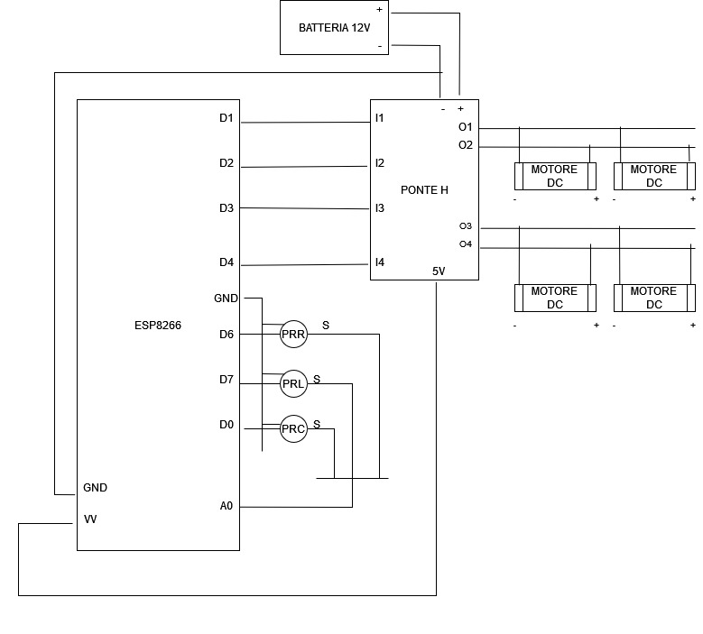
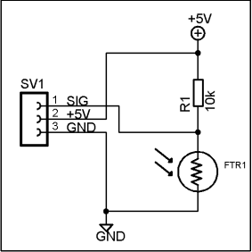

# LightSeeker
LightSeeker è una macchinina che una volta accesa cerca di muoversi nel posto più luminoso possibile. 
Prima di partire le viene assegnato un goal, ovvero di trovare un'intensità di luce che viene assegnata tra 0 e 1024 (unità di misura per la tensione di arduino).
In questo modo è possibile 'telecomandare' LightSeeker utilizzando per esempio una torcia e, nel momento che si trova al centro della luce proiettata da essa si ferma.
Il robottino in questione è costituito da una scatoletta a cui sono stati attaccati ai 4 bordi 4 motori DC, pilotati da un ponte H alimentato da una batteria a 12 V che sono posti all'interno della scatola.
Per orientarsi utilizza due braccia con installate sopra due fotoresistenze e una fotoresistenza centrale fissata al centro.

## Meccanismo

Per impostare il goal ho utilizzato un app chiamata iot On/off, che viene configurata per comunicare con il robot tramite protocollo MQTT. Con essa perciò si può impostare il limite di luce da raggiungere, oltre che impostare velocità e monitorare l'intensità di luce rilevata.
LightSeeker cambia direzione nel momento in cui una delle due fotoresistenze sulle braccia rileva un'intensità significantemente superiore della luce rilevata dalla fotoresistenza centrale. Continua quindi a girare nella direzione segnalata (destra o sinistra) fino a che la fotoresistenza centrale non rileva la stessa intensità, e a quel punto si stabilizza.

##Componenti
- ESP8266
- 4 motori DC (3-6 V)
- 2 fotoresistenze
- 1 batteria a 12V
- Ponte H l298N

## Foto

   
Le fotoresistenze sono state in qualche modo schermate, in modo da non captare la luce nelle direzioni non volute.

## Circuito

 
Poichè l'esp8266 ha solo un input analogico, per leggere una fotoresistenza bisogna prima mettere in modalità input i pin a cui sono attaccate le altre due fotoresistenze (oltre a mettere in modalità output e HIGH il pin associato alla fotoresistenza che si vuole leggere).
La batteria di 12 Volt viene adottata, sia perchè provvede più corrente a lungo termine, sia perchè alimentando con 12 volt il ponte h, esso provvede una carica di 5 volt adatta ad alimentare la board esp8266.

 
Il componente elettronico che per semplicità viene chiamato fotoresistenza, è un circuito stampato che di fatto non è altro che un partitore di tensione tra la fotoresistenza stessa e un resistore di 10k Ohm. Se quindi vengono scambiati nel circuito polo positivo con il polo negativo l'effetto è che quando la fotoresistenza riceverà più luce la tensione in uscita tra le due resistenze sarà maggiore, che torna utile per la logica del progetto.
  

